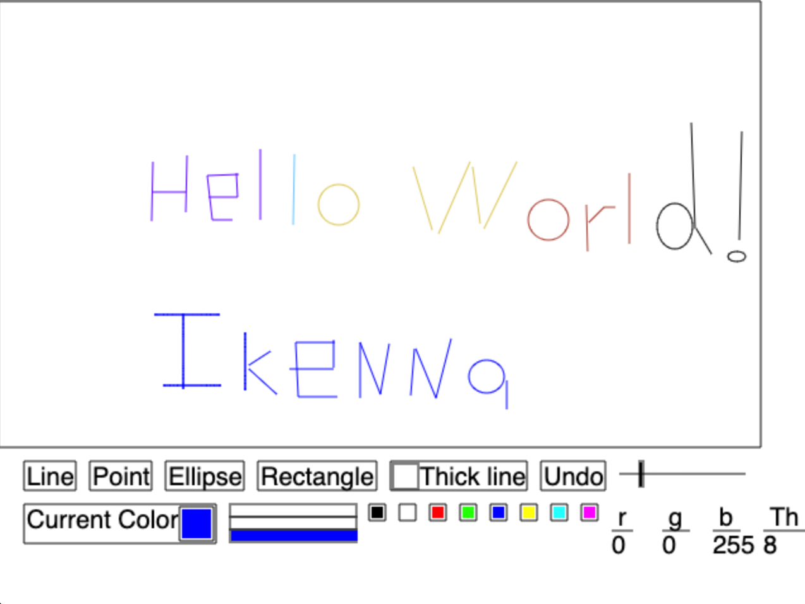

# Programming Languages and Techniques-CIS120 #
Repository for Programming Languages and Techniques (CIS 120, Spring 2019 Upenn)  

As a part of the CIS 120 Programming Languages Course, OCaml code for the following projects was written:
- Paint Gui

## Paint Gui ##
```
gctx.ml
gctx.mli
paint.ml
widget.ml
widget.mli
```
Example Output:



Code is designed to run in Codio environment. Contact me for details

